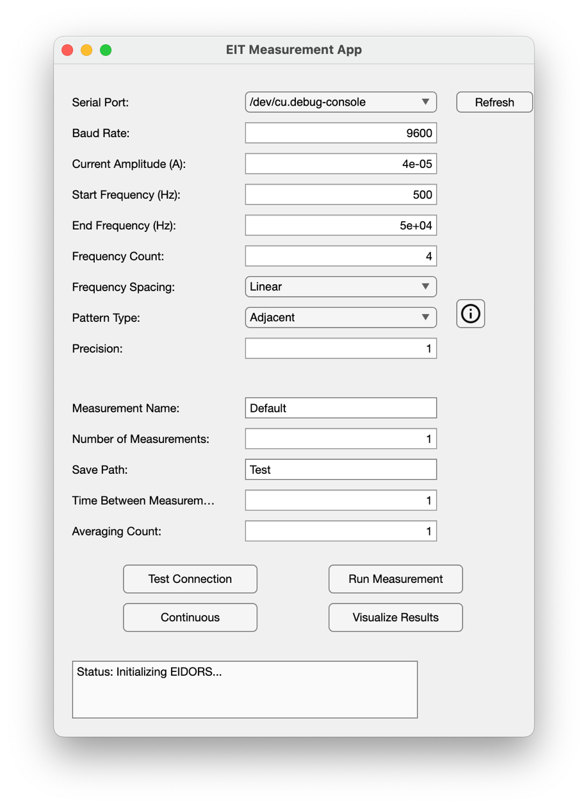
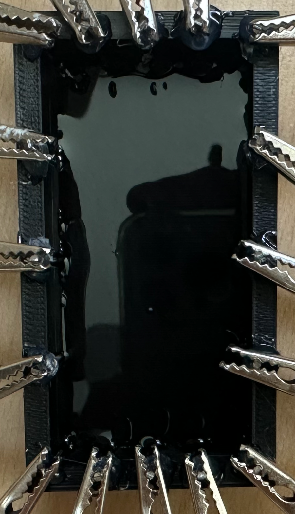
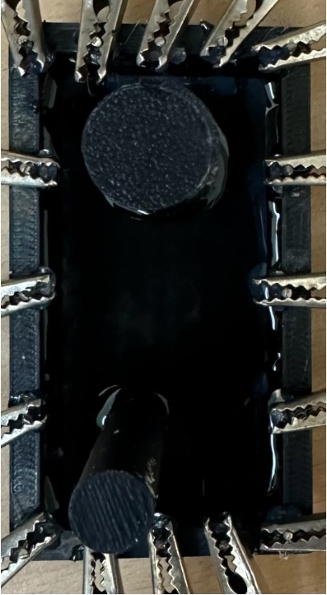
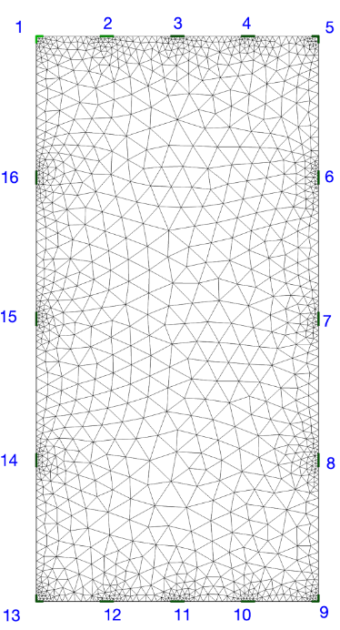

# EIT Measurement App

This application was developed as part of a **Bachelor’s Thesis** at the [Measurement Technology Institute (IMT)](https://www.jku.at/en/institute-of-measurement-technology/) at Johannes Kepler University (JKU). The project focuses on **electrical impedance tomography (EIT)** for analyzing and reconstructing conductivity distributions.

## Features

The **EIT Measurement App** is a MATLAB-based application that provides the following functionality:

1. **Measurement Setup and Configuration**:
   - Configure serial port and baud rate.
   - Define current amplitude, frequency range, and measurement patterns (e.g., Adjacent, Opposite, Diagonal).
   - Enable precision adjustments, averaging, and time delays between measurements.

2. **Measurement Execution**:
   - Continuous or single-run EIT measurements using ScioSpec ISX-3 hardware.

3. **Data Visualization**:
   - Visualize EIT reconstructions with different priors (e.g., Laplace, Gaussian, Tikhonov).
   - Compare measurements with baseline data.

4. **Reconstruction Settings**:
   - Customize solver types, hyperparameters, and iteration counts.
   - Analyze specific frequency components for detailed insights.

---

## Installation and Setup

### Requirements

- MATLAB R2024b or later with the following toolboxes:
  - Optimization Toolbox
  - Statistics and Machine Learning Toolbox
- ScioSpec hardware and driver setup for serial communication.
- Netgen (required for FEM simulation on macOS).

### Installation

1. Clone this repository:

   ```bash
   git clone https://github.com/imt-jku/EIT-Sciospec.git
   ```

2. Ensure the [EIDORS library](https://eidors3d.sourceforge.net/) is installed.
3. Set the required paths for EIDORS and Netgen during the initial setup.

---

## How It Works

### Measurement Workflow

1. **Configure Settings**:
   - Define measurement parameters such as current, frequencies, and pattern type using the app’s interface.

2. **Run Measurements**:
   - Select “Run Measurement” to capture data and save results.
   - Use “Continuous” mode for automated repetitive measurements.
   - All measurement runs are saved as txt-files, which contain the measurement setup

3. **Analyze Results**:
   - Reconstruct the conductivity distribution using FEM models.
 
### Using Sample Measurements

1. Pre-recorded measurements are provided in the `Sample_Measurements` folder.
2. The following injection patterns are included:
   - **Adjacent**
   - **Diagonal**
   - **Hybrid**
   - **Opposite**
3. Results for these patterns are saved in the `Plots` folder. Use the app to load and visualize them.

---

## Models and Plots

- **Measurement Setup**:  
  The experimental setup is shown below:

  <table>
    <tr>
      <td>
        
      </td>
      <td>
        
      </td>
    </tr>
  </table>

- **FEM Model**:  
  The forward model is visualized below (see `images/FEM_Model.png`):

  

- **Reconstruction Results**:  
  Example plots of reconstruction results are stored in the `Plots` folder. Below is a typical plot (e.g., `inv_solve_diff_GN_one_step_prior_laplace_1.00xe-4_single.png`):

  

---

## Results Overview

The results include:
- Reconstructed conductivity distributions using the FEM model.
- Analysis of deviations caused by changes in the medium

## Sciopy
For Python users, there is a complementary library called [Sciopy](https://github.com/EITLabworks/sciopy), which provides similar functionality for EIT applications.

## Citation
If you find this project helpful in your research or work, please cite it as:

[](https://doi.org/10.5281/zenodo.14851906)
--
## LICENSE

This project is licensed under the terms of the [MIT License](LICENSE). 
Copyright [2024] [Alexander Hofer]

